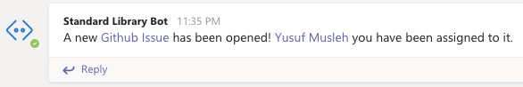
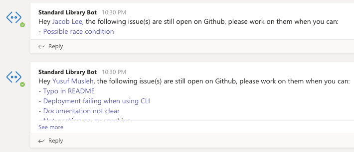
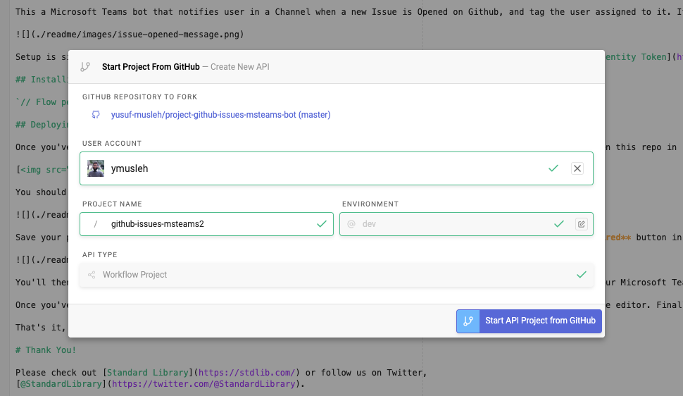
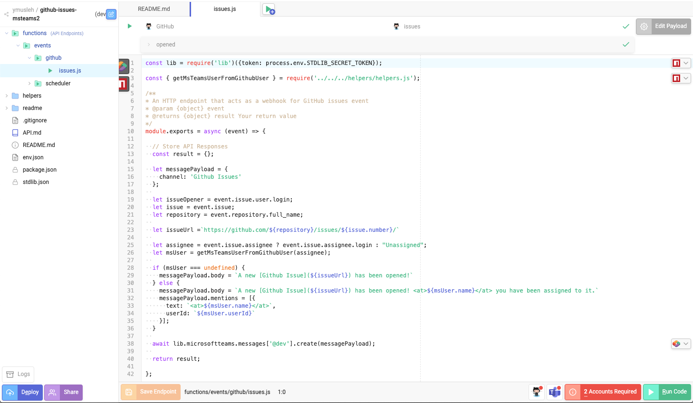

# Microsoft Teams + Airtable Daily Metrics Bot

## Deploy in Seconds

This a Microsoft Teams bot that notifies user in a Channel when a new Issue is Opened on Github, and tag the user assigned to it. It will also ping the users who have Open Issues every hour reminding them about it.

Setup is simple –– you can deploy it without writing any code or configuring any files due to Standard Library's [Identity Token](https://docs.stdlib.com/identity-management-sso-for-apis/what-is-an-identity-token/) support! The only things you need to do are to add the Standard Library bot to your Microsoft Teams organization, have a Github account, link those to resources, and deploy.

## Installing Your Bot Into Teams

`// Flow pending`

## Deploying to Standard Library

Once you've installed the Standard Library app into your Microsoft Teams organization, click the button below to open this repo in [Autocode](https://autocode.stdlib.com/):

You should see a screen like this:

Save your project, then open `functions/events/github/issues.js` in the sidebar and click the red **2 Accounts Required** button in the lower right corner.

You'll then see a modal appear that will prompt you to link your Github Account and select a specific team within your Microsoft Teams organization where you would like to receive notifications.

Once you've linked the required resources, press the orange **Save Endpoint** button in the bottom left corner of the editor. Finally, press the blue **Deploy** button to deploy your project live.

That's it, you're all done! Your bot should be ready to go.

# Thank You!

Please check out [Standard Library](https://stdlib.com/) or follow us on Twitter,
[@StandardLibrary](https://twitter.com/@StandardLibrary).
